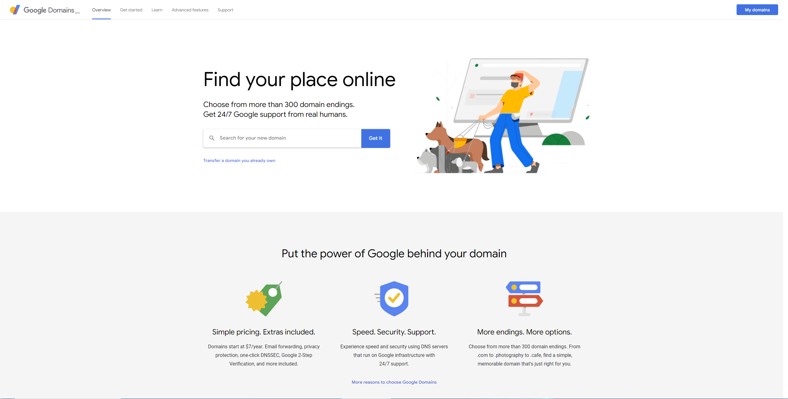
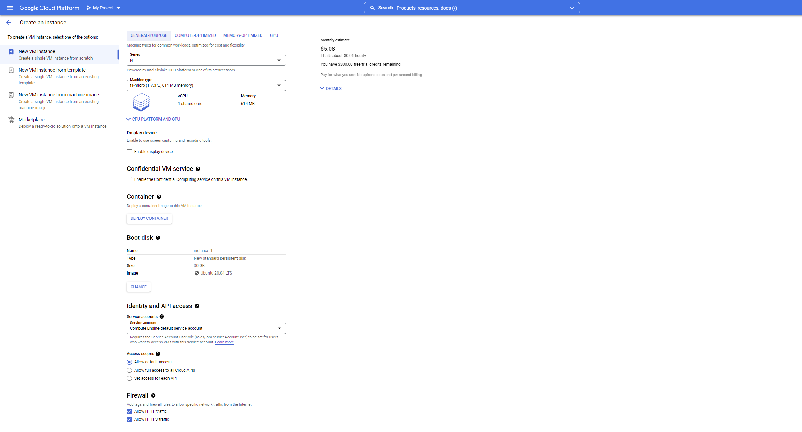
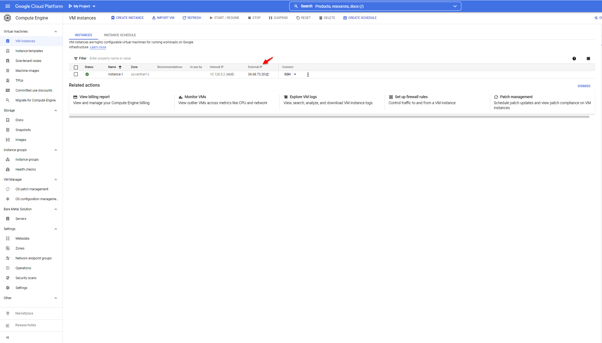
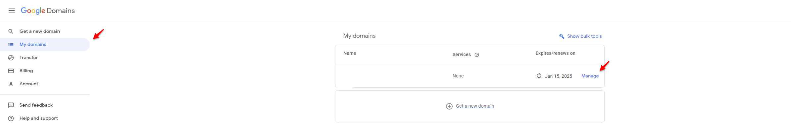
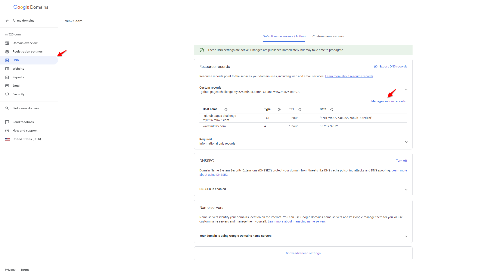

# web_hosting-node_app_deploy
Tutorial about 
1. how to get a domain
2. web hosting for free 
3. deploy node app on website using nginx

# Get a Domain
## Buy a domain from Google Domains(https://domains.google/)

  

1. Search a domain(i.e. helloworld) and buy it.

# Get a Server
## Get a Server from Google Cloud(https://cloud.google.com/compute)
1. Sign up for a Google account.
2. Click sidebar menu and Choose **Compute Engine** -> **VM instances** -> **CREATE INSTANCE**
3. VM setup   
    * Set **Series** to **N1**   
    * Set **Machine type** to **f1-micro (1 vCPU, 614 MB memory)**
    * Set **Boot disk**(system and version is up to you)
        * **Operating system** -> **Ubuntu**
        * **Version** -> **Ubuntu 20.04 LTS**
        * **Boot disk type** -> **Standard persistent disk**
        * **Size** -> **30GB**
    * Set **Firewall**
        * **Allow HTTP traffic**
        * **Allow HTTPS traffic**

As shown in the picture, the cost is $5.08/Month, and we have $300 free trial, so basically free.

## Link the server to your website
1. In your VM instances page, copy the External IP of your VM instance.

2. Go to your google domain page. **My domains** -> **Manage** -> **DNS** -> **Manage custom records** -> **Create new record**

3. records setup
    * **Host name** -> www
    * **Type** -> A  
    * **TTL** -> keep default is ok
    * **Data** -> IP you get from step 1

Now your server should be connected to your website.
