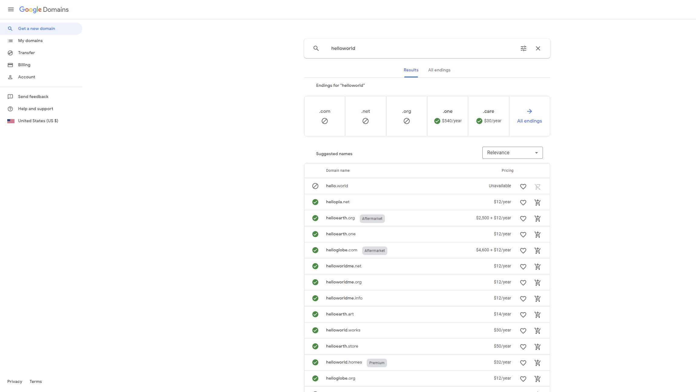

# web_hosting-node_app_deploy
Tutorial about 
1. how to get a domain
2. web hosting for free 
3. deploy node app on website using nginx

# Get a Domain
Buy a domain from Google Domains(https://domains.google/)

  

1. Search a domain(i.e. helloworld) and buy it.

# Get a Server
Get a Server from Google Cloud(https://cloud.google.com/compute)
1. Sign up for a Google account.
2. Click sidebar menu and Choose "Compute Engine" -> "VM instances" -> "CREATE INSTANCE"
3. In the page of creating instance. 
* Set Series to "N1"  
* Set Machine type to "f1-micro (1 vCPU, 614 MB memory)"
* Set Boot disk
    * Operating system -> Ubuntu
    * Version -> Ubuntu 20.04 LTS
    * Boot disk type -> Standard persistent disk
    * Size -> 30GB
